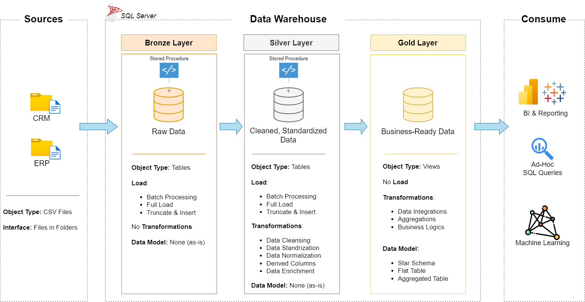

# sql-DataWarehouse-project
This project demonstrates the design and implementation of a **Modern Data Warehouse** using the **Medallion Architecture** (Bronze, Silver, Gold). It simulates integrating data from **CRM and ERP systems**, performs **real-world data quality handling**, and builds a **star schema model** ready for analytics and reporting.

## 📊 Project Highlights

- ✅ **Modern Data Architecture** using Medallion design pattern
- 🔄 **End-to-End ETL pipelines** written in SQL (Bronze → Silver → Gold)
- 🧹 **Real-world data issues handled** across multiple sources
- 🧠 **Star Schema modeling**: fact & dimension views for business insights
- 🧪 **Data quality validation scripts** for Silver & Gold layers

## 🧱 Architecture Overview

The project follows the **Medallion Architecture**, organized as:

*Figure: Data Warehouse Architecture Using Medallion Pattern*

- **Bronze Layer**: Raw structured ingestion from CSV files (via `BULK INSERT`)
- **Silver Layer**: Cleansed and transformed data, joined and validated
- **Gold Layer**: Business-ready views designed as **Fact & Dimension** tables

📌 Refer to the `/docs` folder for visuals:

- `data_architecture.png`
- `data_flow_diagram.png`
- `data_layers.png`
- `data_model.png`
- `integration_model.png`

### 📚 Documentation

- 📄 [Data Catalog](./docs/data_catalog.md)  
- 🧾 [Naming Conventions](./docs/naming_conventions.md)

## 🔄 ETL Layers Breakdown

### 🥉 Bronze Layer: Raw Ingestion

- CSV files from CRM & ERP loaded using `BULK INSERT`
- Minimal validation, raw schema definition
- Schema: `bronze`

### 🥈 Silver Layer: Clean & Transform

- Handles real-world issues:
  - Duplicate keys, unwanted spaces, nulls, invalid date formats
  - Standardizing fields: gender, marital status, product line
  - Fixing broken calculations: sales, price, category IDs
- Uses `ROW_NUMBER`, `CASE`, `ISNULL`, `LEAD`, `TRIM`, joins
- Schema: `silver`

### 🥇 Gold Layer: Star Schema

- **Views** built from `silver` tables:
  - `dim_customers`: clean customer info + country + birthdate
  - `dim_products`: product catalog + category mapping
  - `fact_sales`: transactional facts with surrogate keys
- Ready for BI/Analytics tools
- Schema: `gold`

## 🐛 Real-World Data Issues Solved

### 🔹 CRM Tables
- `cust_info`: duplicates, nulls in PK, inconsistent gender & marital status
- `prd_info`: embedded category in `prd_key`, null costs, abbreviation mappings
- `sales_details`: integer-based invalid dates, broken price/sales logic

### 🔸 ERP Tables
- `cust_az12`: prefixed IDs, future/bad birthdates, inconsistent gender strings
- `loc_a101`: dash-formatted IDs, inconsistent country formats
- `px_cat_g1v2`: merged with product info in gold layer

All issues are addressed in the **Silver ETL layer**.

---

## 🧪 Data Testing & Validation

- ✅ Silver layer tested for:
  - Duplicate removal
  - Null elimination
  - Schema consistency

- ✅ Gold layer tested for:
  - Surrogate key uniqueness
  - Referential integrity (dim-product, dim-customer join checks)
  - Clean business metrics

---

## 🚀 How to Run

1. Run `init_database.sql` to create DB and schemas
2. Execute scripts in this order:
   - `scripts/bronze/ddl-bronze.sql`
   - `scripts/bronze/proc-load-bronze.sql`
   - `scripts/silver/ddl-silver.sql`
   - `scripts/silver/proc-load-silver.sql`
   - `scripts/gold/ddl-gold.sql`
3. Optionally run the test scripts from the `/tests` folder

---

---

## 🙌 About Me

   My name is **Ezz Khalil**, I'm actively building my career in Data Engineering, with a growing skill set in SQL, Python, ETL processes, and data pipeline development. I’m currently learning tools like Apache spark, Docker, and cloud platforms to design scalable and reliable data workflows.

With a strong foundation in AI, machine learning, and data analysis—gained through hands-on internships and academic projects—I bring an analytical mindset and problem-solving approach to everything I do. I'm particularly interested in building the infrastructure that powers data-driven products and supports advanced analytics.

I'm looking for internship or entry-level opportunities where I can contribute, learn from experienced teams, and grow into a well-rounded Data Engineer.  

 

---
